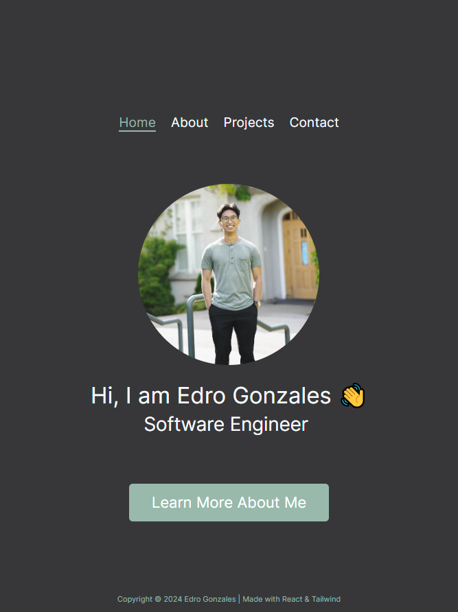

# Edro Portfolio 2024

A personal portfolio website showcasing my projects, skills, and experiences in software development.

## Screenshot

## Built With

-   React
-   React Router Dom
-   React Type Animation
-   Tailwind CSS
-   Framer Motion
-   Material UI Icons

## Features

-   Responsive design ensuring compatibility across various devices.
-   Interactive elements for an engaging user experience.

## Running the Project Locally

To run this project on your local machine:

1. Clone the repository: `git clone [repository-link]`
2. Install dependencies: `npm install`
3. Start the server: `npm start`

## Future Enhancements

-   Adding user testimonials
-   Resume work section

## Contact

-   [LinkedIn](https://www.linkedin.com/in/edrogonzales/)
-   [GitHub](https://github.com/Nog-bs/)
